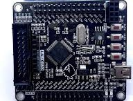
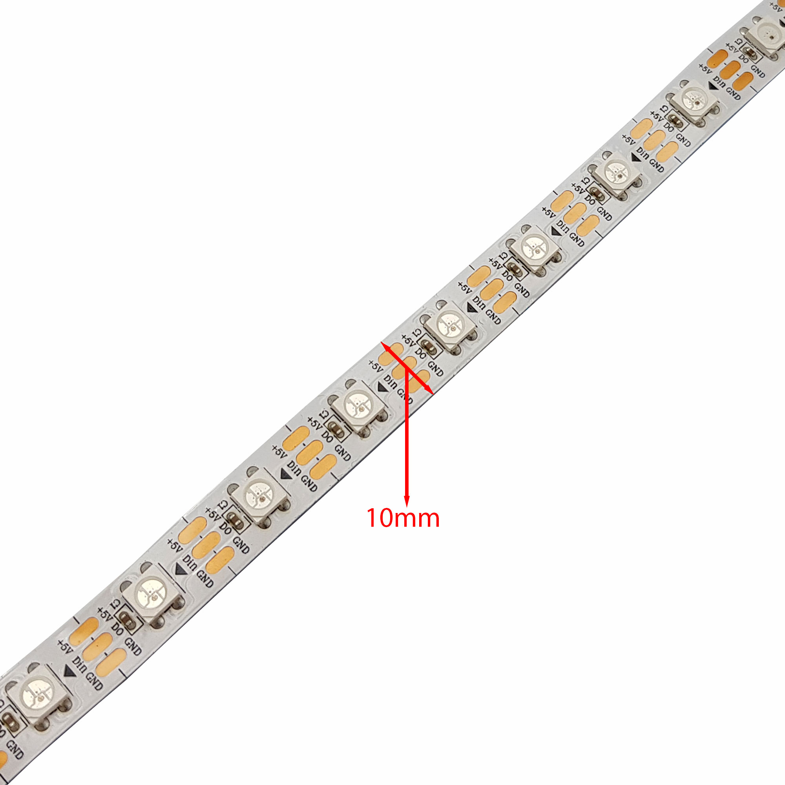

#STM32F103RCT6_RGB_WB2812B_DMA
## Overview
- WS2812B DMA Controller is an embedded firmware project designed to drive WS2812B RGB LEDs using STM32 hardware peripherals with minimal CPU utilization.
- The project leverages TIMER, PWM, DMA to generate the precise timing required by WS2812B LEDs while freeing the CPU for other application tasks.
- A UART + DMA communication interface is implemented to receive lighting commands from external devices such as PCs, microcontrollers, single-board computers, or custom controllers.

## Features
- WS2812B RGB LED control using TIMER, PWM and DMA.
- UART communication using DMA.
- Low CPU utilization.
- Real-time command processing.
- Compatible with external controllers.

## Demo

https://github.com/user-attachments/assets/a9fa222f-2c6d-4a35-bbb5-31cef334d7f6

https://github.com/user-attachments/assets/f81766e0-daf1-4ad0-870b-7d6e16e53fca

## Firmware Architecture

<p align="center">
    <br>
    <em>Fig 0. Firmware Architecture</em>
</p>

## Data Flow

<p align="center">
    <br>
    <em>Fig 1. Data Flow</em>
</p>

## Hardware Requirements
- STM32F103RCT6
- WS2812B RGB LEDs

### STM32F103RCT6
<p align="center">
    <br>
    <em>Fig 2. STM32F103RCT6 KIT</em>
</p>

### LEDS WB2812B
<p align="center">
    <br>
    <em>Fig 3. Leds WB2812 </em>
</p>

## DRIVER WB2812B
 This driver provides efficient control of WS2812 RGB LEDs using TIMER, PWM and DMA. The required WS2812 timing is generated by a hardware timer, while DMA automatically transfers precomputed waveform data to the timer's compare register, minimizing CPU involvement during transmission. Once the LED frame has been fully transmitted, an interrupt service routine (ISR) is triggered to automatically stop the PWM transfer, ensuring proper protocol timing and efficient resource utilization.
The WS2812 protocol requires a bit period of approximately 1.25 µs with an allowable timing tolerance of ±600 ns. To generate a valid waveform, the timer parameters (PSC and ARR) must be selected such that:

Timer Clock = Fclk / (PSC + 1)
Bit Period = (ARR + 1) / Timer Clock
High Time = CCR / Timer Clock

### Gamma Correction and Color Balancing
 To improve visual color quality, the driver supports gamma correction through a Lookup Table (LUT). Human vision perceives brightness non-linearly, meaning that a linear increase in RGB values does not result in a linear increase in perceived brightness. The gamma correction LUT maps input color values to corrected output values, producing smoother brightness transitions and more natural color rendering.
In addition, color balancing is applied to compensate for differences in LED color channel characteristics. Since the red, green, and blue LEDs inside a WS2812B package do not emit light with identical perceived brightness, individual scaling factors can be applied to each color channel before transmission. This adjustment improves white-point accuracy and ensures more consistent color reproduction across the LED strip.

The combination of gamma correction and color balancing provides:
- Smoother brightness gradients.
- Improved low-brightness visibility.
- More accurate white color reproduction.
- Consistent visual appearance across different LED strips.

## UART
 This UART driver combines DMA transfers with UART interrupt events to provide efficient, non-blocking communication.
For reception, DMA continuously stores incoming bytes into a memory buffer while the UART IDLE interrupt is used to detect the end of a message.
For transmission, DMA transfers data directly from memory to the UART peripheral without CPU intervention.
This architecture minimizes CPU usage and enables reliable real-time communication.

## Message Format
### Get numble led controller
```Request
|----------------------------------------------------------------------------|
| Field          		| Size    | Description                              |
|-----------------------|---------|------------------------------------------|
| Header Msg     		| 4 Bytes | Packet header (`0x89`)                   |
| Length field   		| 4 Bytes | Number of bytes in the data field        |
| Data field     		| 4 Bytes | Size Msg                                 |
| Get pixel Led opcode 	| 4 Bytes | Packet header (`0x100`)                  |
| Length field   		| 4 Bytes | Number of bytes in the data field        |
| Data field 	 		| 4 Bytes | Any byte								 |	
|----------------------------------------------------------------------------|
```
```Response  
|----------------------------------------------------------------------------|
| Field          		| Size    | Description                              |
|-----------------------|---------|------------------------------------------|
| Header Msg     		| 4 Bytes | Packet header (`0x89`)                   |
| Length field   		| 4 Bytes | Number of bytes in the data field        |
| Data field     		| 4 Bytes | Size Msg                                 |
| Get pixel led opcode 	| 4 Bytes | Packet header (`0x100`)                  |
| Length field   		| 4 Bytes | Number of bytes in the data field        |
| Data field 	 		| 4 Bytes | Numble led control by Stm32				 |	
|----------------------------------------------------------------------------|
```

### Set Led 
```Request
|----------------------------------------------------------------------------|
| Field          		| Size    | Description                              |
|-----------------------|---------|------------------------------------------|
| Header Msg     		| 4 Bytes | Packet header (`0x89`)                   |
| Length field   		| 4 Bytes | Number of bytes in the data field        |
| Data field     		| 4 Bytes | Size Msg                                 |
| Set color opcode 		| 4 Bytes | Packet header (`0x999`)                  |
| Length field   		| 4 Bytes | Number of bytes in the data field        |
| Data field 	 		| N Bytes | Led value								 |	
|----------------------------------------------------------------------------|
```

```Response  
|----------------------------------------------------------------------------|
| Field          		| Size    | Description                              |
|-----------------------|---------|------------------------------------------|
| Header Msg     		| 4 Bytes | Packet header (`0x89`)                   |
| Length field   		| 4 Bytes | Number of bytes in the data field        |
| Data field     		| 4 Bytes | Size Msg                                 |
| Set color ok opcode 	| 4 Bytes | Packet header (`0x999`)                  |
| Length field   		| 4 Bytes | Number of bytes in the data field        |
| Data field 	 		| 4 Bytes | Any byte								 |	
|----------------------------------------------------------------------------|
```